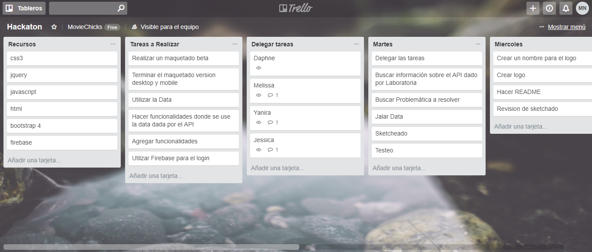

# Challenge Hackathon

Somos del Squad "Movie Chicks", integrado por :

- Daphne Cáceres
- Jessica Meza
- Nataly Ortiz
- Yanira Arenazas

Tenemos el agrado de presentar el proceso de elaboración de nuestro producto "Movie Kids" y el resultado final de ello.

### _Reto_:

En el entorno de la temática del consumo de peliculas. Consiste en crear soluciones/produtos utilizando el API de Open Movie Database (OMDB), con un tiempo límite de 4 días.

Proceso del Desarrollo de nuestro Producto:

## Día 1

#### A. En el aula:

- Conocer nuestro nuevo squad.
- Resaltar las fortalezas de cada una, para enfocarnos en la delimitación de tareas (función de cada integrante).
- Indagar la utilización del API OMDB.
- Escoger un nombre para nuestro Squad.
- Discutir sobre que necesidades sobre la temática de peliculas vamos a cubrir (identificar nuestro usuario).
- Cuáles serán los recursos que vamos a utilizar.
Coodinar qué pareja presentará el dia 2 y quienes el día 4.

#### Resultados dentro del aula:

- Fortalezas resaltadas:

[Daphne Cáceres](https://github.com/DaphneMilena): Muy hábil interactuando con el usuario, hacer testeo, sketch y maquetado. 

[Jessica Meza](https://github.com/jessica2011): Se adapta muy bien en la funcionalidad del producto y el maquetado.

[Nataly Ortiz](https://github.com/Nathoriz): Muy hábil en estructuar el contenido del producto, maquetar y realizar sketch.

[Yanira Arenazas](https://github.com/YaniraAB): Destaca muy bien en la funcionalidad del producto, maquetado y organización del equipo.

- Delimitar tareas:

Daphne y Nataly : encargadas en testear, realizar sketch, estructurar, maquetear y apoyar en funcionalidades extras para resaltar el producto.

Yanira y Jessica: encargadas en la funcionalidad del producto, además de apoyar en el maquetado y el estilo de paleta de colores que se asignará.

- Escoger el nombre de nuestro squad:

Luego de proponer deferentes nombres al squad, el que resaltó y nos agradó fue "Movie Chicks".

- Indagando el API:

Durante una hora, investigamos de qué trata, cómo acceder y cuáles son sus limitaciones de OMDB. Para así enfocarnos y pensar en que sector de usuarios vamos a dar utilidad nuestro producto.

- Recursos a utilizar:

_Medio a interactuar_: Trello, Grupo de whatsapp y Slack.

_Realización de sketch_: Balsamiq Cloud.

_Estructura y estilos_: HTML5 y CSS3.

_Framework de css_: Bootstrap 4.

_Lenguaje de Programación_: Javascript.

_Librerias_: jQuery 3.2.1

_Autentificación, base de datos y Hosting_: Firebase.

- Identificar nuestro Usuario:

Mediante lluvia de ideas para la elección de una problématica no solucionada de los consumidores de cine promedio. Se escogió desarrollar un aplicativo que facilite la elección a padres y cuidadores primarios de niños y niñas con edades entre los 2 y 10 años, de películas teniendo con enfásis en la edad del y gustos de los usuarios objetivo, la usabilidad y la fácil empleabilidad del producto.

#### B. En casa:

- Leer sobre el proceso UX en 

    https://docs.google.com/document/d/1vPXWgLlgOCeelM-s9VRdPQFx3ny2GntxP-5ldqB5Uqk/edit

- Yanira y Jessica : de forma online cordinaban de cómo acceder a la data y poder mostrar en pantalla los resultados.

#### Logros obtenidos en el día 1:

- Investigar productos similares en el mercado local.

- Elaboración de preguntas para el testeo del sketch, aplicada a 5 adeultos con niños en edades entre 2 y 10 años.

- Maketear la vista Index.

- Diseño del logo y paleta de colores.

- Poder acceder a la data y mostrar en pantalla.

#### Imgenes del día 1:

*** 

## Día 2

#### A. En el Aula:

- Daphne y Nataly, nos dierón a conocer los resultados del testeo.
- Encontramos las debilidades de poder tener una busqueda específica con OMDB.
- Coordinamos qué puntos se va hablar en la presentación de ese mismo día.
- Recibimos feedback del equipo de Laboratoria.
- Escuchamos los feedback de las demás equipos.
- Seguimos trabajando en parejas.
- Cada pareja compartio sus avances.

#### B. En casa:

- Nataly y Daphne : Reunión colaborativa en casa de Nataly. Se realiza la estructura de la vista home tanto en desktop como para mobile.

- Daphne: Realizó el maquetado sea responsive de todas las vistas en mobile. ;

- Yanira: Filtró la base de datos mediante checkbox. (se logró nuestro filtró solo para peliculas animadas)

- Jessica : Dio funcionalidad para logear con correo y una contraseña del usuario, dio estilos a la primera vista del producto, y añadio paletas de colores.

#### Logros obtenidos en el día 2:

- El squad se mantuvo comunicado mediante whatsapp, slack y trello para coordinar la subida de los trabajos en forma ordenada y para evitar conflictos en el GitGub
  También se continuo con el intercambio de ideas y feedback interno.

- Producto a un 40% de avanzado. 

#### Imgenes del día 2:

- Maquetado de la primera vista

- Funcionalidad de busqueda de peliculas

- Maquetado, mas paleta de colores de la primera vista

- funcionalidad de logear con google y correo electrónico.

*** 

## Día 3

#### En el Aula

- Como equipo: Daily interno. Se discute los avances, se planifica las acciones a realizarse. Se programa reunión de trabajo colaborativo en casa de Daphne.

- Yanira y Jessica: Van dando funcionabilidad a la vista index. Hacer que se pueda logear con los botones coordinando las clases y estructura.

- Nataly: maquetado de la vista home terminada. Redifinición del logo y los colores del mismo.

- Daphne: Inicia con sección footer, vista con maquetado Guía de Padres

#### En casa

- Yanira: Inicio de jueguito bonus para la página

- Jessica: Finaliza con los filtrados y la obtención de data 

- Daphne y Nataly: Verificación y correción de fallas en el maquetado que se desarrollaron cuando se anexaron los trabajos del squad.

- Nataly: Solución de los problemas leves que se dieron en el maquetado a la hora del merge. 

- Daphne: Finaliza con la vista Guía, footer e inicia con la elaboración de un README detallado

- El trabajo como squad incluye la tarde, noche y madrugada.

- Status del proyecto al final del día 3: 75%

